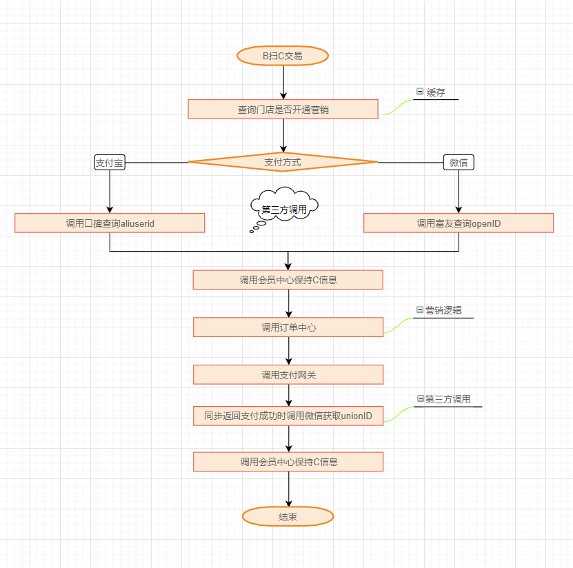

# 代码覆盖率

## 介绍

设想一下，假如在做支付系统，整个交易环节流程如下：


当一个环节出现问题时，都将导致整体交易失败。所以做单元测试尽可能保证每一个环节都会被测试到，这样可以很大程度规避 Bug，从而减少核心业务的`出错几率`，保证服务的稳定性。

单元测试的基本目标：代码覆盖率达到 70% ；核心的应用、业务、模块的语句覆盖率要达到 100%。[《阿里单元测试原则》](https://github.com/alibaba/p3c/blob/master/p3c-gitbook/%E5%8D%95%E5%85%83%E6%B5%8B%E8%AF%95.md#L17)


## 工具

您可以通过 IDEA 自带的工具来查看单元测试的代码覆盖率。

您只需要将鼠标光标停放到被测试的方法上，通过 Ctrl + Shift + T (Win 快捷键）生成单元测试方法，运行测试方法时选择 Run login() whith Coverage 选项，在测试完成后，通过 Coverage 工具栏查看覆盖率即可。

## 演示 [Demo](https://github.com/xiyun-international/java-unit-docs/tree/master/source/middle-stage-test-coverage)

### Service 代码

此处业务代码只处理到调用会员中心保持C端信息。

```java
public class ShopServiceImpl implements ShopService {

    private ShopMapper shopMapper;
    private FuyouDubboService fuyouDubboService;
    private KoubeiDubboService koubeiDubboService;
    private UserDubboService userDubboService;

    /**
     * Mockito使用注解注入依赖关系，需提供构造器
     *
     * @param fuyouDubboService
     * @param koubeiDubboService
     * @param userDubboService
     */
    public ShopServiceImpl(FuyouDubboService fuyouDubboService, KoubeiDubboService koubeiDubboService, UserDubboService userDubboService, ShopMapper shopMapper) {
        this.fuyouDubboService = fuyouDubboService;
        this.koubeiDubboService = koubeiDubboService;
        this.userDubboService = userDubboService;
        this.shopMapper = shopMapper;
    }

    @Override
    public CallResult pay(MarkttingModel markttingModel) {

        CallResult callResult = validate(markttingModel);
        if (callResult != null) {
            return callResult;
        }
        ShopDO shopDO = shopMapper.selectById(markttingModel.getShopId());
        if (!shopDO.getMarktingSwitch()) {
            return CallResult.fail(CallResult.RETURN_STATUS_FAIL, "门店未开通营销活动!");
        }
        CallResult openIdResult = null;
        if (markttingModel.getPayType().equals(PayTypeEnum.PAY_TYPE_FUYOU.getCode())) {
            openIdResult = fuyouDubboService.getOpenId(markttingModel.getFlag());
        }
        if (markttingModel.getPayType().equals(PayTypeEnum.PAY_TYPE_KOUBEI.getCode())) {
            openIdResult = koubeiDubboService.getAliUserId(markttingModel.getFlag());
        }
        if (openIdResult == null || openIdResult.getCode() == CallResult.RETURN_STATUS_FAIL) {
            return CallResult.fail(CallResult.RETURN_STATUS_FAIL, "查询openIdResult失败!");
        }
        String openId = openIdResult.getContent();
        return userDubboService.getUserInfo(openId);
    }
}
```


### 测试代码

此处的单元测试方法已通过 Ctrl + Shift + T (Win 快捷键）创建。您在实际运行时，直接选择 Run login() whith Coverage 选项运行即可。

```java
@Slf4j
@SpringBootTest
class ShopServiceImplTest {

    //通过注解模拟依赖的接口或类
    @Mock
    private ShopMapper mockShopMapper;
    @Mock
    private FuyouDubboService mockFuyouDubboService;
    @Mock
    private KoubeiDubboService mockKoubeiDubboService;
    @Mock
    private UserDubboService mockUserDubboService;

    //通过注解自动注入依赖关系
    @InjectMocks
    private ShopServiceImpl shopService;
    //参数
    static MarkttingModel markttingModel;
    //模拟门店结果
    static ShopDO shopResult;
    //模拟openID查询结果
    static CallResult mockOpenIdResult;
    static CallResult mockUserResult;
    static int shopId = 999;
    static String openId = "asdasd56789asdfgjhkklllasd";
    static String falg = "123456";
    static UserModel mockUserModel;


    @BeforeAll
    static void beforLoginTest() {
        markttingModel = new MarkttingModel();
        markttingModel.setPayAmount(new BigDecimal("26.75"));
        markttingModel.setPayType(PayTypeEnum.PAY_TYPE_FUYOU.getCode());
        markttingModel.setShopId(shopId);
        markttingModel.setFlag(falg);

        shopResult = new ShopDO();
        shopResult.setId(shopId);
        shopResult.setMarktingSwitch(true);

        mockOpenIdResult = new CallResult(CallResult.RETURN_STATUS_OK, "查询成功", "asdasd56789asdfgjhkklllasd");
        mockUserModel = new UserModel("zyq", openId, "17612345678", "zyq");
        mockUserResult = new CallResult(CallResult.RETURN_STATUS_OK, "查询成功", JSONObject.toJSONString(mockUserModel));
    }

    @Test
    @DisplayName("营销支付测试")
    void payTest() {

        Assertions.assertNotNull(markttingModel, "markttingModel can not be null!");
        Assertions.assertNotNull(shopResult, "shopResult can not be null!");
        Assertions.assertNotNull(mockOpenIdResult, "openIdResult can not be null!");
        Assertions.assertNotNull(mockUserModel, "userModel can not be null!");

        when(mockShopMapper.selectById(shopId)).thenReturn(shopResult);
        when(mockFuyouDubboService.getOpenId(falg)).thenReturn(mockOpenIdResult);
        when(mockUserDubboService.getUserInfo(openId)).thenReturn(mockUserResult);

        CallResult callResult = shopService.pay(markttingModel);
        Assertions.assertEquals(CallResult.RETURN_STATUS_OK, callResult.getCode());
        UserModel userModel = JSONObject.parseObject(callResult.getContent(), UserModel.class);
        Assertions.assertEquals(mockUserModel.getMobile(), userModel.getMobile());

        log.info("[测试通过]");
    }
}
```

## 运行结果

当以这种方式运行单元测试后，右侧工具栏会显示出，相关包以及代码的覆盖率的情况。具体点进去找到业务代码，查看覆盖率。图中央红框部分，`绿色部分`展示了在测试过程中执行到的代码，`红色部分`为未执行代码。


```java
2020-03-09 20:49:24.351  INFO 9372 --- [main] c.m.s.test.coverage.UserServiceImplTest  : [测试通过]
```
