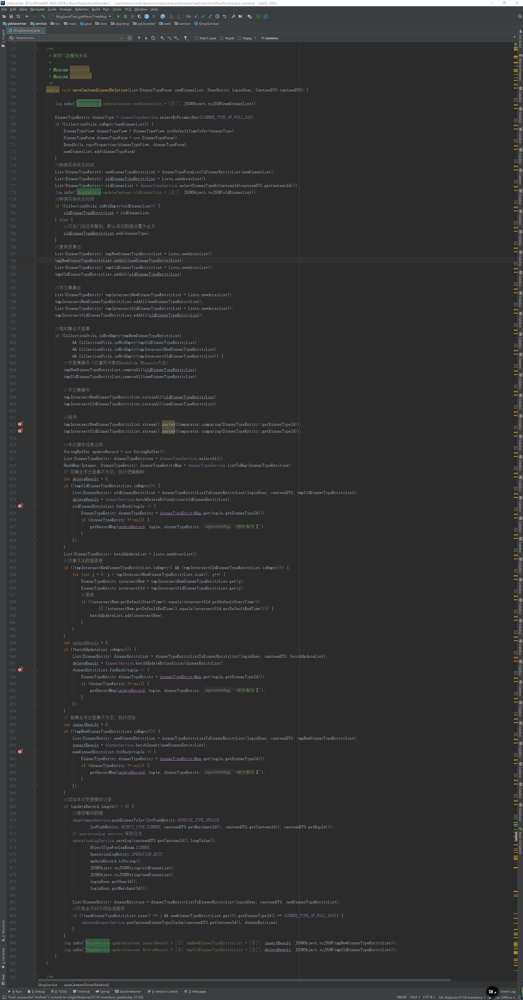

# 代码重构

## 介绍

质量好的代码，在结构上往往比较清晰容易阅读。但现实中，随着需求迭代等因素，导致代码变的臃肿，如下图：

_图(1)_

这样的代码不仅可读性差并且难以维护，还不便于测试。想象一下，上图的 130 行的代码，在进行单元测试时，有时可能都不知道程序运行时会得到什么样的结果，这就增加了编写桩代码的难度，并且代码覆盖率也难以保证。

所以本节将介绍，站在单元测试的角度，怎么针对臃肿代码进行优化。

## 业务场景

### [案例](https://github.com/xiyun-international/java-unit-docs/tree/master/source/middle-stage-test-optimization)

图 1 中是业务代码混乱的效果。结下了，为了便于你的理解，我以一个虚拟的业务`更新门店餐别`来讲解代码优化。

先来大致的了解一下业务逻辑：

- 数据为空，向集合中添加“全天”餐别。
- 处理新旧数据集合。获取各自的差集、交集。
- 集合不为空，批量添加，更新，删除。
- 产生变更记录，推送 ISV，保存日志。
- 集合中不包括“全天”更新缓存。


### [正确示范](https://github.com/xiyun-international/java-unit-docs/blob/master/source/middle-stage-test-optimization/src/main/java/com/middle/stage/test/optimization/service/impl/ShopServiceImpl.java)

- 根据不同功能、业务进行代码拆分。
- 拆分准则做到模块的输入输出可预测。
- 拆分后的模块独立测试。
- 上层业务，组织下层模块代码，测试业务时，模拟下层业务。

如下方展示的伪代码。

```java
public void operate(){
	//验证并设置基础数据
	baseData = validate();
	//得到新旧餐别数据集合，获取交集、差集
	data = processData(baseData);
	//批量添加
	batchInsert(data.insertList);
	//批量更新
	batchUpdate(data.updateList);
	//批量删除
	batchDelete(data.deLeteList);
	//更新缓存，推送数据，记录日志
	push();
}
```

### 优势

这些功能单一、规模较小的逻辑单元会有较大的复用性。在庞大的业务代码中总有一些代码由于耦合度较高，没办法复用。那么以这种提取方式，在今后的开发中，如果需要这些功能，就不用写重复的代码了。

```java
processData(){
	// 求差集
	getDifference();
	// 求交集
	getIntersection();
}
```

## 测试 [Demo](https://github.com/xiyun-international/java-unit-docs/tree/master/source/middle-stage-test-optimization)

[以下代码](https://github.com/xiyun-international/java-unit-docs/blob/master/source/middle-stage-test-optimization/src/main/java/com/middle/stage/test/optimization/service/impl/ShopServiceImpl.java)为优化后的业务代码。

### Service 代码

```java
public class ShopServiceImpl implements ShopService {

    /**
     * 保存门店餐别关系
     *
     * @param loginUser
     * @param canteenDTO
     */
    public CallResult saveCanteenDinnerRelation(List<DinnerTypeForm> newDinnerList, UserDO loginUser, CanteenDTO canteenDTO) {

        log.info("ShopService.updateCanteen newDinnerList = [{}]", JSONObject.toJSON(newDinnerList));

        DinnerTypeDO dinnerType = dinnerTypeService.selectByPrimaryKey(DINNER_TYPE_OF_FULL_DAY);
        if (CollectionUtils.isEmpty(newDinnerList)) {
            DinnerTypeView dinnerTypeView = DinnerTypeView.intDefaultTimeToStr(dinnerType);
            DinnerTypeForm dinnerTypeForm = new DinnerTypeForm();
            BeanUtils.copyProperties(dinnerTypeView, dinnerTypeForm);
            newDinnerList.add(dinnerTypeForm);
        }

        //转换实体类及时间
        List<DinnerTypeDO> newDinnerTypeDOList = dinnerTypeFormListToDinnerTypeDOList(newDinnerList);
        List<DinnerTypeDO> oldDinnerList = dinnerTypeService.selectDinnerTypeByCanteenId(canteenDTO.getCanteenId());
        List<DinnerTypeDO> oldDinnerTypeDOList = Lists.newArrayList();
        if (CollectionUtils.isEmpty(oldDinnerList)) {
            //历史门店没有餐别，默认将旧数据设置为全天
            oldDinnerTypeDOList.add(dinnerType);
        } else {
            oldDinnerTypeDOList = oldDinnerList;
        }
        log.info("ShopService.updateCanteen oldDinnerList = [{}]", JSONObject.toJSON(oldDinnerList));

        //通用集合求差集、交集
        CommonsListUtil commonsListUtil = new CommonsListUtil(newDinnerTypeDOList, oldDinnerTypeDOList).invoke();
        List<DinnerTypeDO> tmpNewDinnerTypeDOList = commonsListUtil.getTmpNewObjectList();
        List<DinnerTypeDO> tmpOldDinnerTypeDOList = commonsListUtil.getTmpOldObjectList();
        List<DinnerTypeDO> tmpIntersectNewDinnerTypeDOList = commonsListUtil.getTmpIntersectNewObjectList();
        List<DinnerTypeDO> tmpIntersectOldDinnerTypeDOList = commonsListUtil.getTmpIntersectOldObjectList();

        //排序
        tmpIntersectNewDinnerTypeDOList.stream().sorted(Comparator.comparing(DinnerTypeDO::getDinnerTypeId));
        tmpIntersectOldDinnerTypeDOList.stream().sorted(Comparator.comparing(DinnerTypeDO::getDinnerTypeId));

        //本次操作信息记录
        StringBuffer updateRecord = new StringBuffer();
        List<DinnerTypeDO> dinnerTypeEntities = dinnerTypeService.selectAll();
        HashMap<Integer, DinnerTypeDO> dinnerTypeDOMap = dinnerTypeService.listToMap(dinnerTypeEntities);

        // 旧集合求出差集不为空，执行逻辑删除
        int deleteResult = getDeleteResult(loginUser, canteenDTO, tmpOldDinnerTypeDOList, updateRecord, dinnerTypeDOMap);

        //交集求出数据更新
        List<DinnerTypeDO> batchUpdateList = Lists.newArrayList();
        setBatchUpdateList(tmpIntersectNewDinnerTypeDOList, tmpIntersectOldDinnerTypeDOList, batchUpdateList);
        int updateResult = getUpdateResult(loginUser, canteenDTO, updateRecord, dinnerTypeDOMap, batchUpdateList);

        // 新集合求出差集不为空，执行添加
        int insertResult = getInsertResult(loginUser, canteenDTO, tmpNewDinnerTypeDOList, updateRecord, dinnerTypeDOMap);

        //添加本次变更操作记录
        if (updateRecord.length() > 0) {
            pushDataAndSaveLog(newDinnerList, loginUser, canteenDTO, newDinnerTypeDOList, oldDinnerList, updateRecord);
        }

        log.info("ShopService.updateCanteen insertResult = [{}] tmpNewDinnerTypeDOList = [{}]", insertResult, JSONObject.toJSON(tmpNewDinnerTypeDOList));
        log.info("ShopService.updateCanteen deleteResult = [{}] tmpOldDinnerTypeDOList = [{}]", deleteResult, JSONObject.toJSON(tmpOldDinnerTypeDOList));
        log.info("ShopService.updateCanteen updateResult = [{}] batchUpdateList = [{}]", updateResult, JSONObject.toJSON(batchUpdateList));
        return CallResult.success(CallResult.RETURN_STATUS_OK, "操作成功", deleteResult + updateResult + insertResult);
    }
}
```

### 测试代码

```java
@Slf4j
@SpringBootTest
class ShopServiceImplTest {

    @Mock
    private DinnerTypeService mockDinnerTypeService;
    @Mock
    private DinnerService mockDinnerService;
    @Mock
    private ShopCommonService mockShopCommonService;
    @Mock
    private CanteenDinnerService mockCanteenDinnerService;
    @Mock
    private OperationLogService mockOperationLogService;

    @InjectMocks
    private ShopServiceImpl shopService;

    @Autowired
    private DinnerTypeMapper dinnerTypeMapper;

    //全部数据集合
    private static List<DinnerTypeDO> dinnerTypeDOList = new ArrayList<>();
    //新餐别数据
    private static List<DinnerTypeForm> newDinnerList = new ArrayList<>();
    //旧餐别数据
    private static List<DinnerTypeDO> oldDinnerList = new ArrayList<>();
    //门店数据
    private static CanteenDTO canteenDTO = new CanteenDTO();
    //用户数据
    private static UserDO userDO = new UserDO();
    //转换map
    private static HashMap<Integer, DinnerTypeDO> dinnerTypeDOMap = new HashMap<>();
    //查询结果
    private static DinnerTypeDO dinnerTypeDO = new DinnerTypeDO();


    /**
     * 测试数据
     */
    @BeforeEach
    void beforSaveCanteenDinnerRelation() {
                userDO.setUserId(1);
        userDO.setUserName("zyq");
        userDO.setMerchantId(1);

        canteenDTO.setCanteenId(279);
        canteenDTO.setMerchantId(96);
        canteenDTO.setEquId(3);

        dinnerTypeDOList = dinnerTypeMapper.selectAll();

        dinnerTypeDO = dinnerTypeMapper.selectByPrimaryKey(1);
        oldDinnerList = dinnerTypeMapper.selectDinnerTypeByCanteenId(279);

        DinnerTypeForm dinnerTypeOne = new DinnerTypeForm(2, "早餐", "09:00", "10:00");
        DinnerTypeForm dinnerTypeTwo = new DinnerTypeForm(3, "午餐", "11:30", "13:00");
        newDinnerList.add(dinnerTypeOne);
        newDinnerList.add(dinnerTypeTwo);

        dinnerTypeDOMap = ShopServiceImpl.listToMap(dinnerTypeDOList);
    }

    @Test
    void saveCanteenDinnerRelation() {

        //设置桩代码
        when(mockDinnerTypeService.selectByPrimaryKey(1)).thenReturn(dinnerTypeDO);
        when(mockDinnerTypeService.selectDinnerTypeByCanteenId(canteenDTO.getCanteenId())).thenReturn(oldDinnerList);
        when(mockDinnerTypeService.selectAll()).thenReturn(dinnerTypeDOList);
        when(mockDinnerTypeService.listToMap(dinnerTypeDOList)).thenReturn(dinnerTypeDOMap);

        // @see https://xiyun-international.github.io/java-unit-docs/05-other/02-api

        //知识点-自定义参数匹配器
        when(mockDinnerService.batchDeleteByCondition(argThat(new BatchDeleteMatcher()))).thenReturn(1);
        when(mockDinnerService.batchUpdateByCondition(argThat(new BatchUpdateMatcher()))).thenReturn(1);
        when(mockDinnerService.batchInsert(argThat(new BatchInsertMatcher()))).thenReturn(1);

        //知识点-无返回值方法的桩代码
        doNothing().when(mockShopCommonService).pushDinnerToIsv(anyInt(), anyInt(), anyInt(), anyInt(), anyInt());
        doNothing().when(mockOperationLogService).saveLog(anyLong(), any(), anyInt(), anyString(), anyString(), anyString(), anyInt(), anyInt());
        doNothing().when(mockCanteenDinnerService).putCanteenDinnerType2Cache(anyInt(), anyList());

        //执行被测试方法
        CallResult callResult = shopService.saveCanteenDinnerRelation(newDinnerList, userDO, canteenDTO);

        //验证是否执行（以目前的测试数据，所有方法都会执行到）
        verify(mockDinnerTypeService).selectAll();
        verify(mockDinnerTypeService).selectByPrimaryKey(1);
        verify(mockDinnerTypeService).selectDinnerTypeByCanteenId(canteenDTO.getCanteenId());
        verify(mockDinnerTypeService).listToMap(dinnerTypeDOList);
        verify(mockDinnerService).batchDeleteByCondition(argThat(new BatchDeleteMatcher()));
        verify(mockDinnerService).batchUpdateByCondition(argThat(new BatchUpdateMatcher()));
        verify(mockDinnerService).batchInsert(argThat(new BatchInsertMatcher()));
        verify(mockShopCommonService).pushDinnerToIsv(anyInt(), anyInt(), anyInt(), anyInt(), anyInt());
        verify(mockOperationLogService).saveLog(anyLong(), any(), anyInt(), anyString(), anyString(), anyString(), anyInt(), anyInt());
        verify(mockCanteenDinnerService).putCanteenDinnerType2Cache(anyInt(), anyList());

        //验证结果
        Assertions.assertNotNull(callResult);
        Assertions.assertEquals(CallResult.RETURN_STATUS_OK, callResult.getCode());
        //验证数据处理条数
        Assertions.assertEquals(3, callResult.getContent());
        log.info("[测试通过]");
    }
}
```

### 运行结果

```java
2020-03-15 01:16:08.055  INFO 13908 --- [main] c.m.s.t.o.service.impl.ShopServiceImpl   : ShopService.updateCanteen newDinnerList = [[{"dinnerTypeName":"早餐","strDefaultEndTime":"10:00","strDefaultStartTime":"09:00","dinnerTypeId":2},{"dinnerTypeName":"午餐","strDefaultEndTime":"13:00","strDefaultStartTime":"11:30","dinnerTypeId":3}]]
2020-03-15 01:16:08.069  INFO 13908 --- [main] c.m.s.t.o.service.impl.ShopServiceImpl   : ShopService.updateCanteen oldDinnerList = [[{"defaultEndTime":120,"dinnerTypeName":"全天","defaultStartTime":60,"dinnerTypeId":1},{"defaultEndTime":660,"dinnerTypeName":"早餐","defaultStartTime":540,"dinnerTypeId":2}]]
2020-03-15 01:16:08.076  INFO 13908 --- [main] c.m.s.t.o.service.impl.ShopServiceImpl   : ShopService.updateCanteen insertResult = [1] tmpNewDinnerTypeDOList = [[{"defaultEndTime":780,"dinnerTypeName":"午餐","defaultStartTime":690,"dinnerTypeId":3}]]
2020-03-15 01:16:08.076  INFO 13908 --- [main] c.m.s.t.o.service.impl.ShopServiceImpl   : ShopService.updateCanteen deleteResult = [1] tmpOldDinnerTypeDOList = [[{"defaultEndTime":120,"dinnerTypeName":"全天","defaultStartTime":60,"dinnerTypeId":1}]]
2020-03-15 01:16:08.076  INFO 13908 --- [main] c.m.s.t.o.service.impl.ShopServiceImpl   : ShopService.updateCanteen updateResult = [1] batchUpdateList = [[{"defaultEndTime":600,"dinnerTypeName":"早餐","defaultStartTime":540,"dinnerTypeId":2}]]
2020-03-15 01:16:08.085  INFO 13908 --- [main] c.m.s.t.o.ShopServiceImplTest            : [测试通过]

```

## 分享

最后给大家分享一篇文章 [35 个 Java 代码性能优化总结](https://wenku.baidu.com/view/d865624053d380eb6294dd88d0d233d4b14e3f30.html)。请根据工程的实际业务场景，参考这些优化点。
