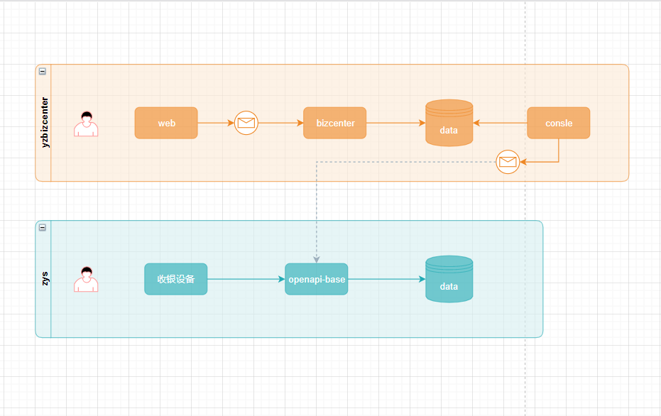

# 上下游系统不可用

## 介绍

在分布式系统中，一个调用链路可能会涉及到多个业务系统，如下图：

_图 (1)_

在增加新功能时多个业务系统，开发完成时间是不同步的，服务不能随时提供。

如果下游系统服务未开发完成，那这时上游系统如何进行单元测试，来保障代码没有问题？  
如果下游系统已经开发完成，那它怎么保障服务是可用并且稳定的？

针对这些问题，本节将介绍，在这些场景下如何去做单元测试。

## 业务场景 - 上游系统不可用

以上图举例，智云膳系统需要接收商家中心推送的基础数据，智云膳保存数据后，用户才能在收银设备上登录。  
以收银系统为基准，那么此时，智云膳系统就位于商家中心的上游。  
如果这时，智云膳接收推送数据的接口还处于开发中，接口是不可直接调用用的。那么商家中心要怎么进行测试呢？

[下载 Demo](https://github.com/xiyun-international/java-unit-docs/tree/master/source/middle-stage-test-unavailable)

### Service 代码

此处业务为，商家中心推送基础数据，发送的是 HTTP 请求到智云膳系统。

```java
@Slf4j
@Service
public class ShopServiceImpl implements ShopService {

    @Autowired
    private PushDataMapper pushDataMapper;

    @Autowired
    private ShopMapper shopMapper;

    private HttpClientUtil httpClientUtil;

    private String url = "http://127.0.0.1:6666/:";

    public ShopServiceImpl(PushDataMapper pushDataMapper, ShopMapper shopMapper, HttpClientUtil httpClientUtil) {
        this.pushDataMapper = pushDataMapper;
        this.shopMapper = shopMapper;
        this.httpClientUtil = httpClientUtil;
    }

    public ShopServiceImpl() {

    }

    @Override
    public CallResult pushData() {

        PushData pushData = pushDataMapper.selectLately();
        if (pushData == null) {
            return CallResult.success(CallResult.RETURN_STATUS_OK, "没有可以推送的数据", null);
        }
        ShopDO shopDO = shopMapper.selectById(pushData.getObjectId());

        CallResult callResult = null;
        try {
            String result = httpClientUtil.sendHttpPost(url, JSONObject.toJSONString(shopDO));
            callResult = new CallResult(CallResult.RETURN_STATUS_OK, "调用成功", result);
        } catch (Exception e) {
            callResult = new CallResult(CallResult.RETURN_STATUS_FAIL, "推送数据失败！");
            log.error("推送数据失败  callResult = [{}]", callResult, e);
        }
        return callResult;
    }
}
```

### 测试代码

假设智云膳系统此时接口未开发完成，服务不可用。我们可以通过模拟 HTTP 请求结果来测试推送业务，这样不论是 RPC 接口还是 HTTP 请求，只要给出接口定义，万物皆可模拟。

[注意](https://xiyun-international.github.io/java-unit-docs/05-other/01-faq#%E6%A8%A1%E6%8B%9F-staticprivate-%E6%96%B9%E6%B3%95)：static、final、private 除外。

```java
@Slf4j
@SpringBootTest
class MiddleStageTestUnavailableApplicationTests {

    @Mock
    private PushDataMapper pushDataMapper;

    @Mock
    private ShopMapper shopMapper;

    @Mock
    private HttpClientUtil httpClientUtil;

    @InjectMocks
    private ShopServiceImpl shopService;

    private static PushData pushData;
    private static ShopDO shopDO;
    private static Integer objectId = 123;
    private String url = "http://127.0.0.1:6666/:";
    private String httpResult = "ok";

    @BeforeAll
    static void beforePushDataTest() {
        pushData = new PushData();
        pushData.setObjectId(objectId);
        pushData.setObjectType(1);

        mockShopResult = new ShopDO();
        mockShopResult.setShopId(objectId);
        mockShopResult.setShopName("zyq");
    }

    @Test
    void pushDataTest() throws Exception {

        //判断测试数据是否为空
        Assertions.assertNotNull(pushData, "pushData can not be null");
        Assertions.assertNotNull(mockShopResult, "shopDO can not be null");

        //设置桩代码
        when(pushDataMapper.selectLately()).thenReturn(pushData);
        when(shopMapper.selectById(objectId)).thenReturn(mockShopResult);
        when(httpClientUtil.sendHttpPost(url, JSONObject.toJSONString(mockShopResult))).thenReturn(httpResult);

        //执行推送
        CallResult callResult = shopService.pushData();

        //验证
        verify(pushDataMapper).selectLately();
        verify(shopMapper).selectById(objectId);
        verify(httpClientUtil).sendHttpPost(url, JSONObject.toJSONString(mockShopResult));

        //判断结果是否符合预期
        Assertions.assertEquals(CallResult.RETURN_STATUS_OK, callResult.getCode());
        Assertions.assertEquals(callResult.getContent(), httpResult);
        log.info("[测试通过]");
    }
}
```

### 运行结果

```java
2020-03-13 16:18:21.651  INFO 5816 --- [main] ddleStageTestUnavailableApplicationTests : [测试通过]
```

## 业务场景 - 下游系统不可用

以图 (1)举例，如果此时商家中心要推送的数据，还没开发完成。那么智云膳，要怎么进行开发和测试呢？

[下载 Demo](https://github.com/xiyun-international/java-unit-docs/tree/master/source/middle-stage-test-unavailable)

### Controller 代码

智云膳接收商家中心推送数据：

```java
@RestController
public class ApiShopController {

    @PostMapping("/shop/save")
    @ResponseBody
    public CallResult shopSave(@RequestBody ShopDO shopDO) {
        if (shopDO == null) {
            return CallResult.fail(CallResult.RETURN_STATUS_PARAM_ERROR, "参数异常，请检查参数！");
        }
        return CallResult.success(CallResult.RETURN_STATUS_OK, "数据保存成功", JSONObject.toJSONString(""));
    }
}
```

### 测试代码

还是继续采用 MockMvc 对象。模拟商家中心推送基础数据，来测试接口的可用性。如果想最大限度保证接口可用，可针对接口做[边界条件测试](https://baike.baidu.com/item/%E8%BE%B9%E7%95%8C%E6%9D%A1%E4%BB%B6%E6%B5%8B%E8%AF%95/1924335?fr=aladdin)及异常测试（输入错误数据，测试程序能否正常运行）。

```java
@Slf4j
@SpringBootTest
@AutoConfigureMockMvc
class ApiShopControllerTest {

    @Autowired
    private MockMvc mockMvc;

    static ShopDO shopDO;

    @BeforeAll
    static void beforSaveTest() {
        shopDO = new ShopDO();
        shopDO.setShopId(1);
        shopDO.setShopName("zyq");
    }

    @Test
    void saveTest() throws Exception {

        //验证测试用例是否创建
        Assertions.assertNotNull(shopDO, "shopDO is null");

        MockHttpServletResponse response = mockMvc.perform(MockMvcRequestBuilders.post("/shop/save")
                .contentType(MediaType.APPLICATION_JSON)
                .content(JSONObject.toJSONString(shopDO)))
                .andDo(MockMvcResultHandlers.print())
                .andReturn()
                .getResponse();
        
        //验证http状态码
        Assertions.assertNotEquals(MockMvcResultMatchers.status().isOk(), response.getStatus());
        CallResult shopResponse = JSONObject.parseObject(response.getContentAsString(), CallResult.class);
        //验证业务状态码
        Assertions.assertEquals(shopResponse.getCode(), CallResult.RETURN_STATUS_OK);

        ShopDO shopResult = JSONObject.parseObject(shopResponse.getContent(), ShopDO.class);
        Assertions.assertEquals(shopDO.getShopName(), shopResult.getShopName());
        log.info("[测试通过]");
    }
}
```

### 运行结果

```java
MockHttpServletResponse:
           Status = 200
    Error message = null
          Headers = [Content-Type:"application/json;charset=UTF-8"]
     Content type = application/json
             Body = {"code":1,"msg":"数据保存成功","content":"\"\""}
    Forwarded URL = null
   Redirected URL = null
          Cookies = []
2020-03-13 16:48:20.543  INFO 16620 --- [main] c.m.s.t.u.C.ApiShopControllerTest        : [测试通过]
```
