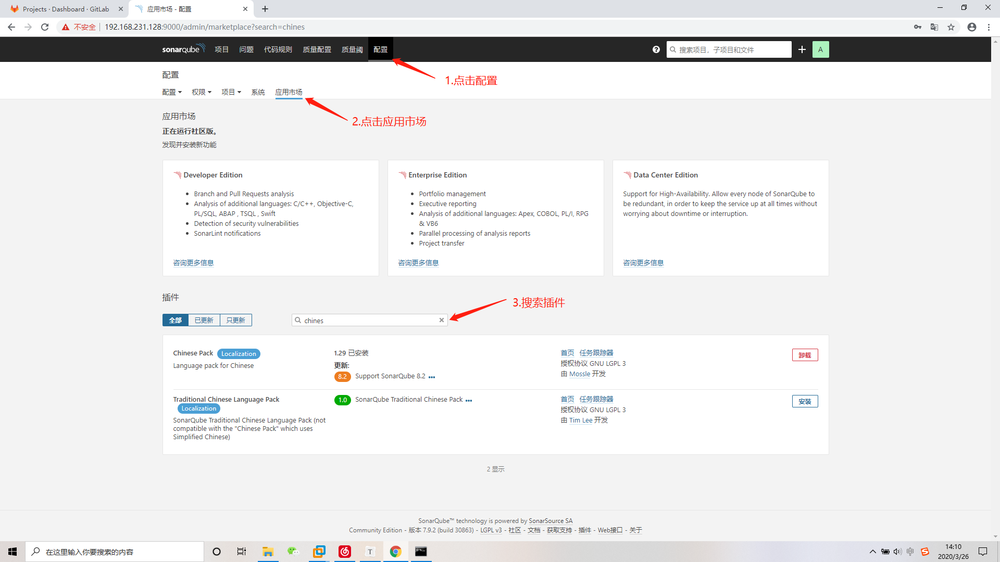
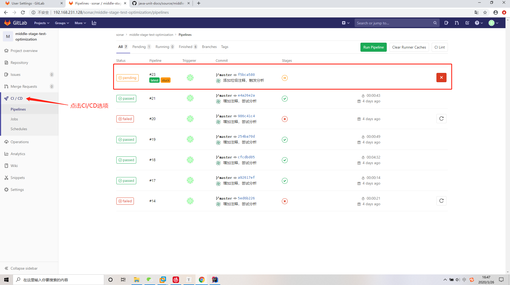
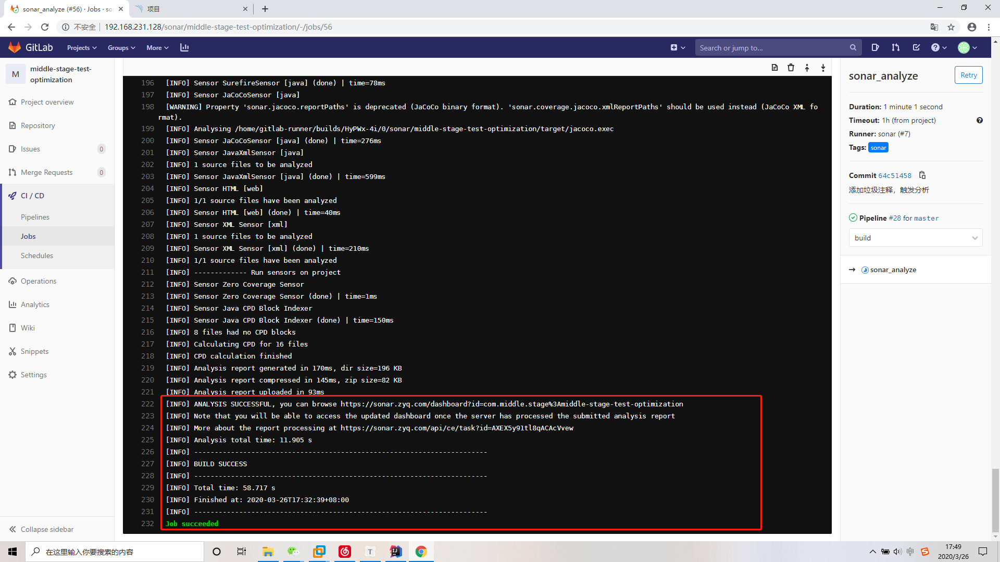
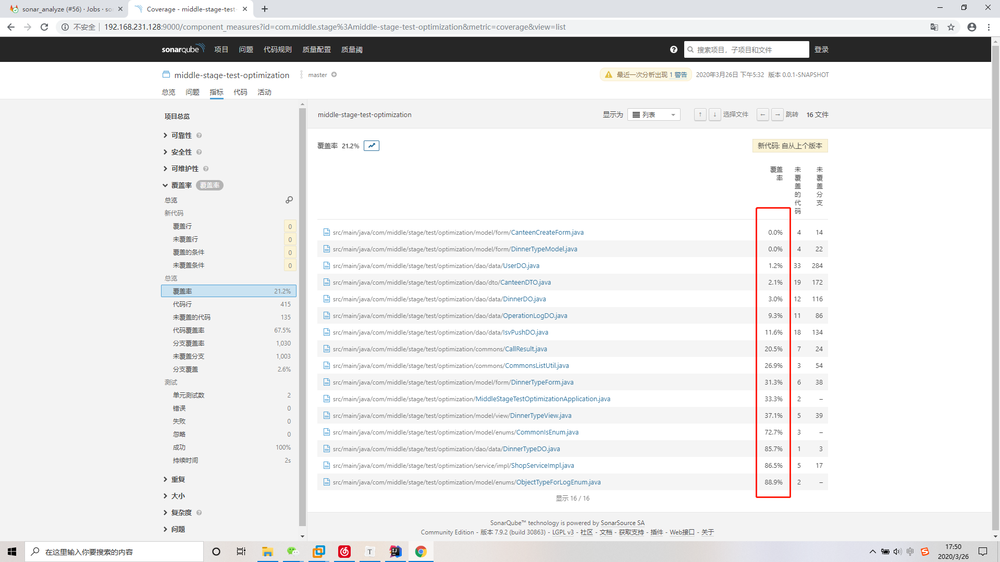

# GitLab-CI + Sonar

## 背景

目前只能通过本地 IDE 来检测代码质量以及单元测试覆盖率。没办法通过一个自动化的平台来给所有的研发人员提供这些检测服务，要解决这个问题，就需要搭建一套持续集成的检测服务。

现方案为：通过 GitLab CI + GitLab Runner + SonarQube 在每次 `commit` 代码时完成自动化检测，通过 SonarQube 平台让所有研发人员查看检测结果。

## 部署架构图


## 安装

### GitLab + SonarQube

对于 GitLab + SonarQube 的安装请看 `docker-compose.yml`。

#### docker-compose.yml

```yml
version: "3"
services:
  sonarqube:
    image: sonarqube:7.9-community
    container_name: 'sonarqube7.9'
    ports:
      - "9000:9000"
    networks:
      - cinet
    environment:
      - SONARQUBE_JDBC_URL=jdbc:postgresql://db:5432/sonar
  db:
    image: postgres:11.1
    container_name: 'postgres'
    networks:
      - cinet
    environment:
      - POSTGRES_USER=sonar
      - POSTGRES_PASSWORD=sonar
  gitlab:
    image: gitlab/gitlab-ce:latest
    container_name: 'gitlab'
    ports:
      - '80:80'
      - '443:443'
      - '220:22'
networks:
  cinet:
    driver: bridge
```

最好不要更改镜像版本，不同版本 GitLab 和 SonarQube 的授权访问是不同的。

```shell
# 使用 docker-compose 启动服务。
$ docker-compose up
```

GitLab 访问地址：http://localhost:8080，首次访问时需设置 `root` 账号密码。

SonarQube 访问地址：http://localhost:9000，默认账号密码为 `admin`。

#### 基础配置及插件安装

**SonarQube 插件安装**

1. 点击 Administration；
2. 点击 Marketplace；
3. 在 Plugins 处搜索插件；
4. 重启 SonarQube 服务；

需要安装的插件：

1. Chinese Pack（中文包）；
2. GitLab Auth（GitLab 访问授权插件）；

如图(此处已安装中文包)：



Gitlab 无需其他基础配置，请自行注册账号并将提供的[源码工程]()提交到仓库。

### GitLab-Runner

使用 docker 安装 runner 时，可能出现镜像下载不完全的情况，所以采用 Linux 的安装方式。

1.下载

```shell
$ sudo curl --output /usr/local/bin/GitLab-ci-multi-runner https://GitLab-ci-multi-runner-downloads.s3.amazonaws.com/latest/binaries/GitLab-ci-multi-runner-darwin-amd64
```

2.授权

```shell
$ sudo chmod +x /usr/local/bin/GitLab-ci-multi-runner
```

3.注册（使用 docker 安装需登录容器进行注册）

```shell
$ GitLab-ci-multi-runner register
```

```shell
#输入下图中的URL
#Please enter the GitLab-ci coordinator URL (e.g. https://GitLab.com/):

#输入下图中的token
#Please enter the GitLab-ci token for this runner:

#输入一个描述信息(随便输入),sonar
#Please enter the GitLab-ci description for this runner:

#输入标签，后续编写gitlab_ci文件需用到,sonar
#Please enter the GitLab-ci tags for this runner (comma separated):

#设置是否可以无标签构建,false
#Whether to run untagged builds [true/false]:

#设置runner是否为锁定状态,false
#Whether to lock Runner to current project [true/false]:

#选择执行方式，这里我选择shell
#Please enter the executor: docker-ssh+machine, docker, docker-ssh, parallels, shell, ssh, virtualbox, docker+machine:

#注册成功，接下来启动
#Runner registered successfully. Feel free to start it, but if it's running already the config should be automatically reloaded!
```


4.安装 & 启动

```shell
$ GitLab-ci-multi-runner install 
$ GitLab-ci-multi-runner start
```

5.查看版本

```shell
$ GitLab-runner -version
```

```shell
Version:      9.5.0
Git revision: 413da38
Git branch:   9-5-stable
GO version:   go1.8.3
Built:        Tue, 22 Aug 2017 13:40:41 +0000
OS/Arch:      linux/amd64
```


## 授权配置

### GitLab 授权配置

#### 配置

1.点击Admin Area  ---> 2.点击Applications  ---> 3.点击New Application 进入添加页面。如图（此图用编辑举例，演示填写）：


#### 保存

保存成功后生成的 Application ID 及 Secret 在 SonarQube 授权时需填写。


### SonarQube 授权配置

#### 配置

**1.点击配置  ---> 2.点击通用配置  ---> 3.选择Gitlab选项**

下图红框中描述翻译如下：

为了启用Gitlab身份验证：

- SonarQube必须只能通过HTTPS公开访问。
- 必须将属性 **sonar.core.serverBaseURL** 设置为此公共 **HTTPS URL**。
- 在您的GitLab配置文件中，您需要创建一个开发人员应用程序，其“授权回调URL”必须设置为`<value_of_sonar.core.serverBaseURL_property>/oauth2/callback/GitLab`。

此处的 **sonar.core.serverBaseURL** 即为 GitLab 中设置的回调 **URI**，对其属性值的设置，请沿着Gitlab选项卡向下寻找到**通用**选项卡，在其中设置值即可。


#### 登录授权

配置完成后，请重新登录，这时登录选项中会出现**通过 GitLab 登录**，如图：


点击 GitLab 登录，如果此时没有登录的账号，则会跳转到 GitLab 登录页面，如果已有登录的 GitLab 账号，则会直接跳转到下图页面，如图：


点击 Authorize 即可完成授权。


## 提交代码触发分析

完成授权配置后，请先下载提供的[**源码**](https://github.com/xiyun-international/java-unit-docs/tree/master/source/middle-stage-test-sonar)并提交到 GitLab 中。此处的演示为直接在 master 分支修改代码并提交的演示。提交代码后，Gitlab 会自动通过 GitLab-runner 执行构建任务，点击CI/CD选项即可看到执行中的任务。如下图：




首次构建因为需要下载依赖的包，所以时间会比较长，建议搭建 nexus。构建成功显示下图：




构建成功后，登录 SonarQube 平台，即可看到分析结果，如下图：


点击进入项目即可看到具体指标，这里以覆盖率举例：




## 问题及解决方案

还在整理