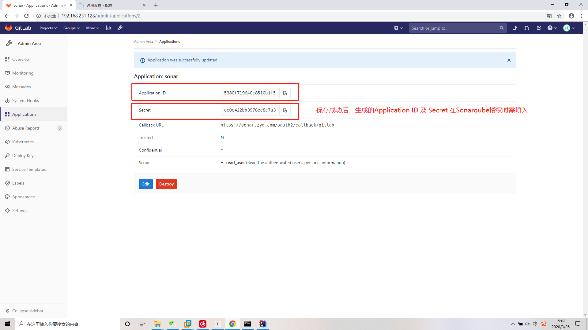
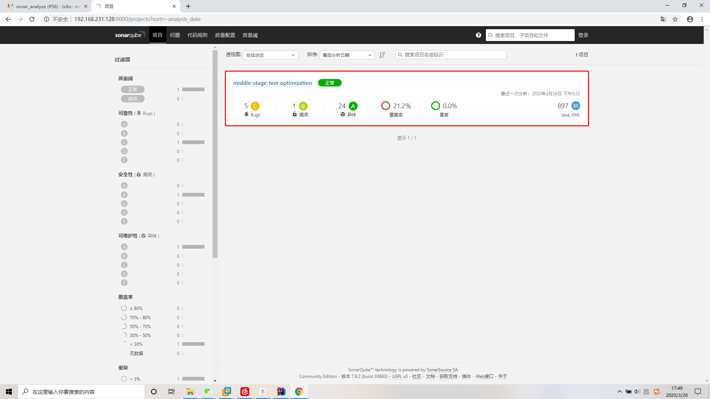

# 持续集成检测

## 背景

研发人员目前只能本地检测代码质量，查看单元测试覆盖率，没办法通过一个自动化的平台来给所有研发人员提供这些检测服务。要解决这个问题，就需要搭建一套持续集成检测的服务。现方案为：通过 Gitlab-CI + gitlab-runner + Sonarqube 在每次 commit 代码时完成自动化检测，通过 Sonarqube 平台让所有研发人员查看检测结果。

## 部署架构图


图中的 Sonar Scanner我并没有部署单独的服务，而是采用在 .gitlab_ci.yml 执行 mvn 命令，通过 maven 插件来做扫描。

## 环境、软件安装

由于我的虚拟机系统为 centos7，所以此次环境的搭建基于 centos7。

### docker

1.安装需要的软件包， yum-util 提供 yum-config-manager功能。

```shell
$ sudo yum install -y yum-utils device-mapper-persistent-data lvm2
```

2.设置yum源

```shell
$ sudo yum-config-manager --add-repo https://download.docker.com/linux/centos/docker-ce.repo
```

3.查看仓库中所有 docker 版本，可选择特定版本安装，这里列举了最新的三个版本。

```shell
$ yum list docker-ce --showduplicates | sort -r
```

|                  |      版本       |                  |
| :--------------: | :-------------: | :--------------: |
| docker-ce.x86_64 | 3:19.03.8-3.el7 | docker-ce-stable |
| docker-ce.x86_64 | 3:19.03.7-3.el7 | docker-ce-stable |
| docker-ce.x86_64 | 3:19.03.6-3.el7 | docker-ce-stable |

说明：版本号为第一个冒号 `:` 开始，直到第一个连字符 `-` 之间的数字字符串。如：19.03.58。

4.安装

```shell
#安装命令 sudo yum install docker-ce-版本号
#这里我选用了最新版本：19.03.58。
$ sudo yum install docker-ce-19.03.58
```

5.启动并加入开机启动

```shell
#启动
$ sudo systemctl start docker
#开机启动
$ sudo systemctl enable docker
```

6.查看docker版本

```shell
$ docker version
```

```
Client: Docker Engine - Community
 Version:           19.03.8
 API version:       1.40
 Go version:        go1.12.17
 Git commit:        afacb8b
 Built:             Wed Mar 11 01:27:04 2020
 OS/Arch:           linux/amd64
 Experimental:      false

Server: Docker Engine - Community
 Engine:
  Version:          19.03.8
  API version:      1.40 (minimum version 1.12)
  Go version:       go1.12.17
  Git commit:       afacb8b
  Built:            Wed Mar 11 01:25:42 2020
  OS/Arch:          linux/amd64
  Experimental:     false
 containerd:
  Version:          1.2.13
  GitCommit:        7ad184331fa3e55e52b890ea95e65ba581ae3429
 runc:
  Version:          1.0.0-rc10
  GitCommit:        dc9208a3303feef5b3839f4323d9beb36df0a9dd
 docker-init:
  Version:          0.18.0
  GitCommit:        fec3683
```

### docker-compose

1.安装

可以访问 https://github.com/docker/compose/releases/ 自行选择版本。

```shell
$ curl -L https://github.com/docker/compose/releases/download/1.25.4/docker-compose-`uname -s`-`uname -m` -o /usr/local/bin/docker-compose
```

2.授权

```shell
$ chmod +x /usr/local/bin/docker-compose
```

3.查看版本

```shell
$ docker-compose version
```

```
docker-compose version 1.25.4, build 8d51620a
docker-py version: 4.1.0
CPython version: 3.7.5
OpenSSL version: OpenSSL 1.1.0l  10 Sep 2019
```

### Gitlab + Sonarqube

对于 Gitlab + Sonarqube 的安装已给出 docker-compose.yml。将 yml 放入虚拟机执行命令，即可拉取所需镜像并启动容器运行。

说明：最好不要更改镜像版本，不同版本Gitlab 和 Sonarqube 的授权访问是不同的，此处采用的都为教新版本。

```shell
# 运行命令即可拉取所需镜像，并启动容器。
$ docker-compose up
```

Gitlab 访问地址：http://192.168.231.129 ，首次访问时，需设置 root 账号密码。

Sonarqube 访问地址：http://192.168.231.129:9000，默认账号密码为 admin。

#### docker-compose.yml

```yml
version: "3"
services:
  sonarqube:
    image: sonarqube:7.9-community
    container_name: 'sonarqube7.9'
    ports:
      - "9000:9000"
    networks:
      - cinet
    environment:
      - SONARQUBE_JDBC_URL=jdbc:postgresql://db:5432/sonar
  db:
    image: postgres:11.1
    container_name: 'postgres'
    networks:
      - cinet
    environment:
      - POSTGRES_USER=sonar
      - POSTGRES_PASSWORD=sonar
  gitlab:
    image: gitlab/gitlab-ce:latest
    container_name: 'gitlab'
    ports:
      - '80:80'
      - '443:443'
      - '220:22'
networks:
  cinet:
    driver: bridge
```

#### 基础配置及插件安装

**Sonarqube 插件安装**

1.点击Administration  --->  2.点击Marketplace  --->  3.在 Plugins 处搜索插件  --->  4.重启 Sonarqube 服务

需要安装的插件：**1.Chinese Pack（中文包）**、**2.GitLab Auth（Gitlab访问授权插件）**。

如图(此处已安装中文包)：


**Gitlab**

Gitlab无需其他基础配置，请自行注册账号并将提供的[源码工程]()提交到仓库。

### gitlab-runner

由于我使用 docker 安装 runner 时，总不能将镜像下载完全，等了几小时也没有反应，如图（始终卡在此处）：


所以采用 Linux 的安装方式安装 gitlab-runner。

1.下载

```shell
$ sudo curl --output /usr/local/bin/gitlab-ci-multi-runner https://gitlab-ci-multi-runner-downloads.s3.amazonaws.com/latest/binaries/gitlab-ci-multi-runner-darwin-amd64
```

2.授权

```shell
$ sudo chmod +x /usr/local/bin/gitlab-ci-multi-runner
```

3.注册（使用 docker 安装需登录容器进行注册）

```shell
$ gitlab-ci-multi-runner register
-----------------------------------------------------------------------------------------
#输入下图中的URL
#Please enter the gitlab-ci coordinator URL (e.g. https://gitlab.com/):

#输入下图中的token
#Please enter the gitlab-ci token for this runner:

#输入一个描述信息(随便输入),sonar
#Please enter the gitlab-ci description for this runner:

#输入标签，后续编写gitlab_ci文件需用到,sonar
#Please enter the gitlab-ci tags for this runner (comma separated):

#设置是否可以无标签构建,false
#Whether to run untagged builds [true/false]:

#设置runner是否为锁定状态,false
#Whether to lock Runner to current project [true/false]:

#选择执行方式，这里我选择shell
#Please enter the executor: docker-ssh+machine, docker, docker-ssh, parallels, shell, ssh, virtualbox, docker+machine:

#注册成功，接下来启动
#Runner registered successfully. Feel free to start it, but if it's running already the config should be automatically reloaded!
```


4.安装 & 启动

```shell
$ gitlab-ci-multi-runner install 
$ gitlab-ci-multi-runner start
```

5.查看版本

```shell
$ gitlab-runner -version
-----------------------------------------------------------------------------------------
Version:      9.5.0
Git revision: 413da38
Git branch:   9-5-stable
GO version:   go1.8.3
Built:        Tue, 22 Aug 2017 13:40:41 +0000
OS/Arch:      linux/amd64
```


## 授权配置

### Gitlab 授权配置

#### 配置

1.点击Admin Area  ---> 2.点击Applications  ---> 3.点击New Application 进入添加页面。如图（此图用编辑举例，演示填写）：


#### 保存

保存成功后生成的 Application ID 及 Secret 在 Sonarqube 授权时需填写。




### Sonarqube 授权配置

#### 配置

**1.点击配置  ---> 2.点击通用配置  ---> 3.选择Gitlab选项**

下图红框中描述翻译如下：

为了启用Gitlab身份验证：

- Sonarqube必须只能通过HTTPS公开访问。
- 必须将属性 **sonar.core.serverBaseURL** 设置为此公共 **HTTPS URL**。
- 在您的GitLab配置文件中，您需要创建一个开发人员应用程序，其“授权回调URL”必须设置为`<value_of_sonar.core.serverBaseURL_property>/oauth2/callback/gitlab`。

此处的 **sonar.core.serverBaseURL** 即为 Gitlab 中设置的回调 **URI**，对其属性值的设置，请沿着Gitlab选项卡向下寻找到**通用**选项卡，在其中设置值即可。


#### 登录授权

配置完成后，请重新登录，这时登录选项中会出现**通过 Gitlab 登录**，如图：


点击 Gitlab 登录，如果此时没有登录的账号，则会跳转到 Gitlab 登录页面，如果已有登录的 Gitlab 账号，则会直接跳转到下图页面，如图：


点击 Authorize 即可完成授权。


## 提交代码触发分析

完成授权配置后，请先下载提供的[**源码**](https://github.com/xiyun-international/java-unit-docs/tree/master/source/middle-stage-test-sonar)并提交到 Gitlab 中。此处的演示为直接在 master 分支修改代码并提交的演示。提交代码后，Gitlab 会自动通过 gitlab-runner 执行构建任务，点击CI/CD选项即可看到执行中的任务。如下图：


首次构建因为需要下载依赖的包，所以时间会比较长，建议搭建 nexus。构建成功显示下图：


构建成功后，登录 Sonarqube 平台，即可看到分析结果，如下图：




点击进入项目即可看到具体指标，这里以覆盖率举例：


## 问题及解决方案

还在整理